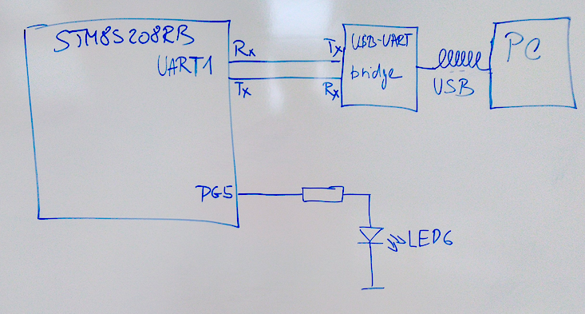

UART ovládá rychlost blikání LED
===========================

Účel/Zadání/Funkce
-----------------------

* Program, bude reagovat na číslice 0-9, které uživatel pošle na UART. Ostatní znaky musí být ignorovány.
	* Použijeme přerušení UART-Rx.
	* Klávesa 0 blikání LED zastaví v tom stavu v jakém LED je při jejím stisku/přijmu.
	* Klávesa 9 nastavuje nejvyšší rychlost blikání, tedy nejkratší periodu; klávesa 1 nastavuje nejpomalejší blikání a tedy nejdelší periodu.
	* Po změně rychlosti pošleme na UART zprávu o aktuální periodě a frekvenci.
	* Rychlost 1 až 9 se nemusí měnit lineárně

Schema zapojení
-----------------------

Popis funkce
-----------------------

1. Rozblikám LED, rychlost je uložena v proměnné
2. povolím přerušení od UARTu
3. rutina přerušení čte znak a nastavuje proměnnou, která ovládá rychlost

Zhodnocení
-----------------------

Narozdíl od druhého úkolu jsem tady neměl velké problémy. Inspiroval jsem se kodem z minulé hodiny a během 2 hodin jsem to dal dohromady.
Myslím si že práce je odvedená víc než chvalitebně, a proto bych chtěl za tenhle projekt známku 1.